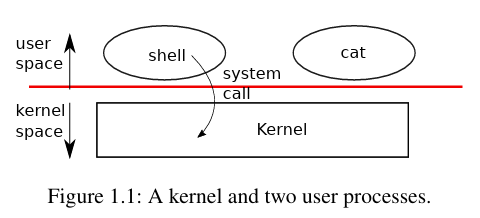
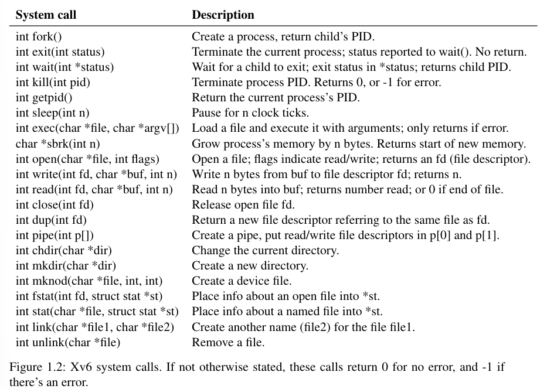

# Operating system interfaces

- `kernel`: provides services to running programs
- `process`: each running program consists of memory containing instructions, data, and a stack
- `system call`: when a `process` needs to invoke a kernel service, it invokes a `system call`
  - a `system call` enter the `kernel`
  - the `kernel` performs the service and returns
  - THUS: a `process` alternates between executing in `user space` and `kernel space`
- `hardware protection mechanisms`:
  - the `kernel` executes with the hardware privileges required to implement these protections
  - `user programs` execute without the privileges

## 1.1 Processes and memory

**In xv6 os**:

- an process

  - user-space memory(instructions, data, and stack)
  - per-process state private to the kernel
- `xv6` time-shares the processes:

  - transparently switches the available CPUs among the set of processes waiting to execute
- `PID`: a process identifier associated with each process
- `fork`: create a new process by a process

  - returns in both the original and new processes
    - original: return new process's `PID`
    - new: return `zero`
    - 

  
