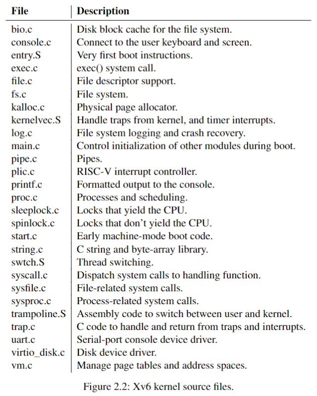
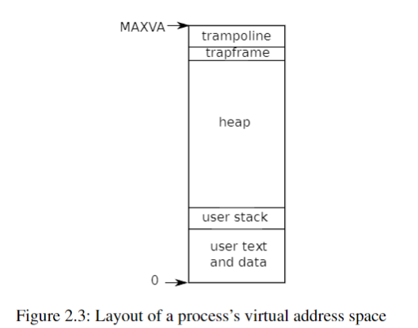

# Chapter2 Operating system organization

- characteristics: 
    - *time-share*
    - *isolation* between processes
    - *interaction* between processes
- *monolithic kernel*: one way to fulfill the characteristics

## 2.1 Abstracting physical resources

## 2.2 User mode, supervisor mode, and system calls
- operating system should be able to `clean up` failed applications and continue with others
- `machine mode`: full privilege
- `supervisor mode`: CPU is allowed to execute `privileged instructions` -- `kernel space`
    - enable/disable interrupts
    - read/write the register that holds the address of a page table
- `user mode`: user space
- an application must invoke a kernel function by transition to the kernel

## 2.3 Kernel organization
- `monolithic kernel`: the entire operating system resides in the kernel
- `microkernel`: to reduce the risk, execute the bulk of the operating system in `user mode`

## 2.4 Code: xv6 organization

layout:

## 2.5 Process overview
transition into the kernel and the back:
    - `trampoline`: reserve a page, 
    - `trapframe`: page mapping
- pieces of state for each process: `struct proc`
    - `page table`, `kernel stack`, `run state`: `p->pagetable`
- `thread`: can be suspended and resumed
    - `p->kstack`: the state of the thread is stored on the stacks
    - user stack: when the process is executing the